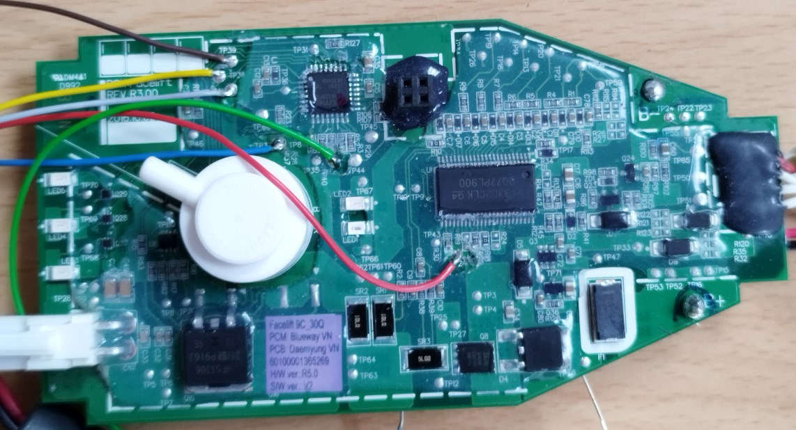
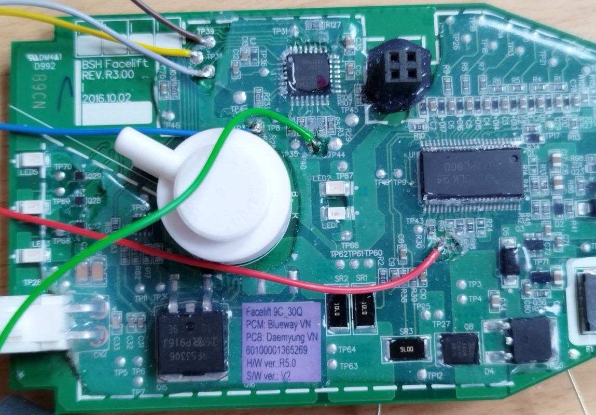
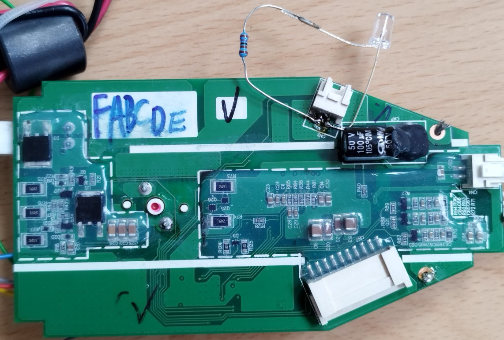
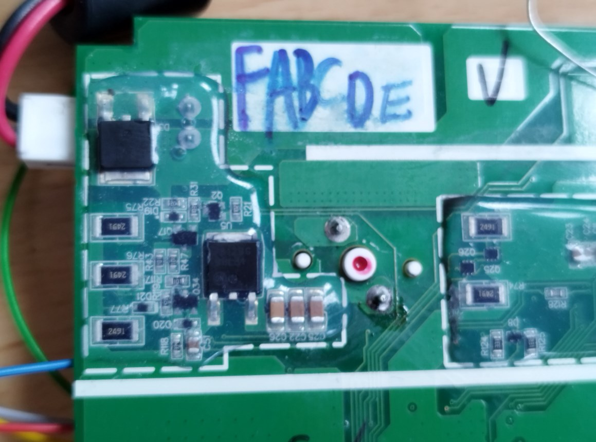
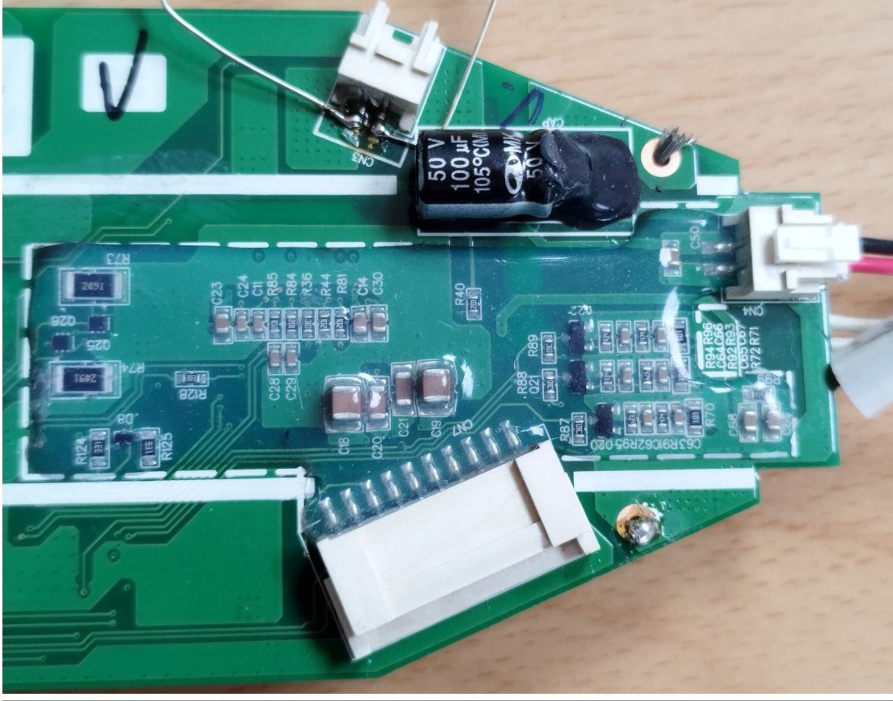

# Bosch Athlet Vacuum Cleaner Investigations

## PCB Fotos







## How to read the content of the ATmega?

### Preconditions:

- Hardware: USBasp (USB-to-AVR programmer). Connect MISO, MOSI, SCK, RES, GND and 3.3V.
- Software: avrdude. Pitfall: The avrdude which comes with the arduino IDE is quite old and reports errors. Use the official avrdude from
https://github.com/avrdudes/avrdude/releases e.g. version 8.1.

- Use ZADIG tool to assign the libusb-win32 to the USBasp.

### Commands (avrdude)

1. Read Flash Memory

`avrdude -c usbasp -p m328pb -U flash:r:flash_dump.hex:i`

-c usbasp — specifies USBasp as programmer
-p m328pb — target is ATmega328PB
-U flash:r:flash_dump.hex:i — read flash, save as Intel HEX

2. Read EEPROM

`avrdude -c usbasp -p m328pb -U eeprom:r:eeprom_dump.hex:i`

3. Read Fuse Bits

`avrdude -c usbasp -p m328pb -U lfuse:r:lfuse.hex:h -U hfuse:r:hfuse.hex:h -U efuse:r:efuse.hex:h`

:h outputs in hexadecimal format

## How to flash new software on the ATmega?

- In arduino IDE, select a board with atmega328pb, e.g. "Atmel atmega328pb Xplained mini".
- Menu -> Sketch -> Export Compiled Binary
- In a windows command window:
```
C:\UwesTechnik\bosch-athlet-vacuumcleaner-investigations\arduino_sketches>C:\LegacyApp\avrdude\avrdude.exe -C C:\LegacyApp\avrdude\avrdude.conf -c usbasp -p m328pb -U flash:w:"C:\UwesTechnik\bosch-athlet-vacuumcleaner-investigations\arduino_sketches\demo_just_blink\build\atmel-avr-xminis.avr.atmega328pb_xplained_mini\demo_just_blink.ino.hex":i
Reading 928 bytes for flash from input file demo_just_blink.ino.hex
Writing 928 bytes to flash
Writing | ################################################## | 100% 0.57 s
Reading | ################################################## | 100% 0.39 s
928 bytes of flash verified

Avrdude done.  Thank you.
```

## How to configure the Arduino IDE for the correct clock speed?

Observation: When (randomly) using the board "Atmel atmega328bp Xplained mini", the time of delay() is twice to long. Root cause is, that F_CPU is set to 16 MHz, while the internal oscillator only runs at 8 MHz.
Change the frequency in boards.txt from 16000000L to 80000L. File location: C:\Users\<you>\AppData\Local\Arduino15\packages\atmel-avr-xminis\hardware\svr\0.6.0\ The arduino IDE needs a restart and a fresh compile to take-over this setting.


## Controller Pins


| ATmega Pin | ATMega Function | Arduino Pin |Athlet Function |
| ---------- | ----------- |----------- |----------- |
|    1       |  PD3        |   3   |   switch step2 eco (all switches low-active)   |
|    2       |  PD4        |   4   |   switch_step3 high   |
|    7       |  PB6        |  *)   |   LED2 blue   |
|    8       |  PB7        |  *)   |   LED1 red    |
|    9       |  PD5        |   5   |   switch step4 turbo   |
|   13       |  PB1        |   9   |   CN2 MainMotor    |
|   14       |  PB2        |  10   |   CN3 AuxMotor    |
|   15       |  PB3 MOSI   |  11   |   LED3     |
|   16       |  PB4 MISO   |  12   |   LED4     |
|   17       |  PB5 SCK    |  13   |   LED5     |
|   10       |  PD6        |   6   |   GateDriverEnable    |
|   12       |  PB0        |   8   |   PressureSensor (needs pull-up. switches to 0 if over-pressure is applied to the upper pipe)     |
|   ?        |  ?          |   ?   |   CurrentFeedback?    |

The access to PB6 and PB7 is not standard Arduino, and depends on the used header files. One approach is to install "MiniCore (328pb)" but this is an other dependency which complicates the usage. So we use direct port access instead.

## References

* Ref1: microcontroller.net forum discussion https://www.mikrocontroller.net/topic/513088
* Ref2: Lenas schematics: https://www.mikrocontroller.net/topic/513088#7515079
* Ref3: ino file for 32V V1_4 from Drago Sept 2024: https://www.mikrocontroller.net/topic/513088#7734328
* Ref4: pinout of the ATmega including arduino pin names and functions https://www.reddit.com/r/arduino/comments/gyrdii/atmega328p_tqfp32_pinout/#lightbox